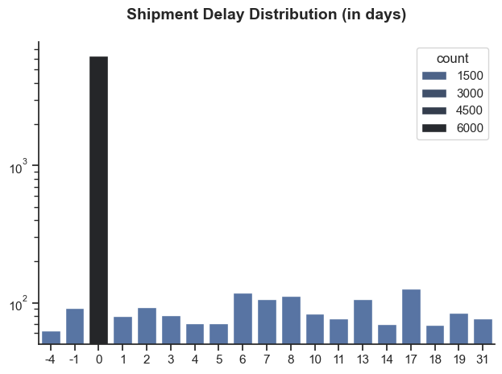
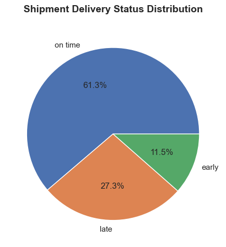
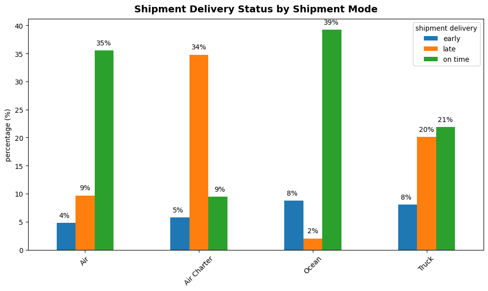
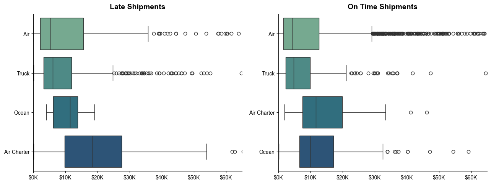

# Supply Chain Cost & Delivery Performance Analysis

A data analytics project that evaluates **delivery reliability** and **logistics cost behavior** using historical shipment records.  
The analysis focuses on **shipment delays (early / on-time / late)**, how delays differ by **shipment mode**, **country**, **product group**, and **vendor**, and whether delays are associated with **higher freight costs**.

---

## Table of Contents
- [Project Objectives](#project-objectives)
- [Business Questions](#business-questions)
- [Dataset](#dataset)
  - [Key Fields Used](#key-fields-used)
  - [Delay Definition](#delay-definition)
  - [Delivery Status Rules](#delivery-status-rules)
- [Methodology](#methodology)
- [How to Read This Project](#how-to-read-this-project)
- [Notebooks](#notebooks)
- [Key Outputs](#key-outputs)
- [How to Run](#how-to-run)
- [Results Summary](#results-summary)
- [Limitations](#limitations)
- [Future Improvements](#future-improvements)
- [Author](#author)

---

## Project Objectives
The goal of this project is to:
1. Measure how often shipments are delayed and how severe delays are.
2. Identify which **shipment modes** lead to the longest delays.
3. Compare delivery performance across **countries**.
4. Evaluate whether **delayed shipments cost more**.
5. Assess the **trade-off between delivery speed and cost**.
6. Highlight **product groups most exposed to delays**.
7. Benchmark **vendor reliability** to identify best and worst performers.

---

## Business Questions
This project answers the following questions:

- **Are shipments often delayed?**  
- **Which shipment modes cause the longest delays?**  
- **Do delivery times vary by country?**  
- **Do delayed shipments cost more?**  
- **Is there a trade-off between delivery time and cost?**  
- **Which product groups are most at risk of delays?**  
- **Which vendors are the most reliable?**

---

## Dataset
The analysis is based on a CSV file (example name used in the notebook):

- `Supply_Chain_Shipment_Pricing_Data.csv`

The dataset (as loaded in the notebook) contains **10,324 rows** and **33 columns**.

### Key Fields Used
To keep the analysis focused and reproducible, the project primarily uses these columns:

- `country`
- `vendor`
- `shipment mode`
- `product group`
- `sub classification`
- `po sent to vendor date`
- `scheduled delivery date`
- `delivered to client date`
- `freight cost (usd)`
- `line item insurance (usd)`

### Delay Definition
Delivery delay is computed from dates:

> **Delay (days) = Delivered to Client Date − Scheduled Delivery Date**

Interpretation:
- **Negative delay** = delivered early
- **Zero delay** = delivered on time
- **Positive delay** = delivered late


### Delivery Status Rules
Each shipment is classified as:

- **Early**: delay < 0  
- **On time**: delay = 0  
- **Late**: delay > 0  

This enables analysis of delay patterns using both numeric delay and categorical status.

---

## Methodology
The workflow follows a standard analytics pipeline:

1. **Data loading & inspection**
   - Check column types, missing values, and basic dataset structure.

2. **Preprocessing & feature engineering**
   - Convert delivery date columns to datetime.
   - Compute `delay` in days.
   - Create `shipment delivery` (Early / On time / Late).

3. **Exploratory analysis & KPI measurement**
   - Delay distribution
   - Late rate, on-time rate
   - Performance by mode / country / vendor / product group

4. **Cost analysis**
   - Clean cost fields (`freight cost (usd)`) to numeric.
   - Compare freight costs by delivery status.
   - Explore delay vs cost relationship.

5. **Visualization & interpretation**
   - Use charts to support business conclusions and recommendations.

---

## How to Read This Project
The analysis is organized into multiple notebooks, each answering a specific business question.
For best understanding, notebooks should be read in the following order:

1. [Data Preparation](#data-preparation)
2. [Overall Delivery Performance](#overall-delivery-performance)
3. [Shipment Mode Impact](#shipment-mode-impact)
4. Country & Vendor Performance
5. Cost Impact & Product Risk
6. Final Conclusions & Recommendations
---

# Data Preparation

```python
import ast
import pandas as pd
import seaborn as sns
import matplotlib.pyplot as plt 
import numpy as np

df = pd.read_csv(r'c:\Users\HP\Downloads\Supply_Chain_Shipment_Pricing_Data.csv')

cols_to_keep = [
    'country', 'vendor', 'shipment mode',
    'product group', 'sub classification',
    'po sent to vendor date', 'scheduled delivery date',
    'delivered to client date',
    'freight cost (usd)', 'line item insurance (usd)'
]
df = df[cols_to_keep]

list_to_date = ['scheduled delivery date', 'delivered to client date']

df = df.copy()                                          # To avoid SettingWithCopyWarning

for col in list_to_date:
    df[col] = pd.to_datetime(df[col], format='mixed')    # mixed format handles different date formats
```
View my notebook with detailed steps here: [Data Preparation](<Notebooks/Data Preparation.ipynb>).


# Overall Delivery Performance

## To what extent do shipment delays occur ?
This analysis examines delivery timing across all shipments to determine how often delays occur and how severe they are. By comparing scheduled delivery dates with actual delivery dates, the study identifies patterns in early, on-time, and late deliveries. The results provide a baseline understanding of overall delivery reliability and highlight whether shipment delays represent isolated incidents or a recurring operational issue.

View my notebook with detailed steps here: [Overall Delivery Performance](<Notebooks/Overall Delivery Performance.ipynb>).

## Visualize Data
````python
sns.set_theme(style = 'ticks')
sns.barplot(data = df_delai_count,
            x = 'delay',
            y = 'count',           
            hue = 'count',
            palette = 'dark:b_r',
           )
sns.despine()                                        # Remove the top and right spines from plot


plt.yscale("log")
plt.xlabel('')
plt.ylabel('')
plt.title('Shipment Delay Distribution (in days)', pad = 20, fontsize = 14, fontweight = 'bold')

plt.tight_layout()
plt.show()
````
## Results:

*bar chart showing shipment delay distribution*


## **Insight:**  
- Most shipments experience **zero or minimal delay**, indicating generally effective execution.  
- A **small number of shipments incur extended delays**, creating a long tail that disproportionately impacts overall performance.  
- **Targeting the root causes of severe delays** would yield the highest improvement in service reliability.
---
## Visualize Data
````python
df_delai['shipment delivery'].value_counts().plot(kind = 'pie',
                xlabel = '', 
                ylabel = '',
                figsize = (8,5),
                autopct = '%1.1f%%',                # Show percentages on pie chart
                
                  )

plt.title('Shipment Delivery Status Distribution', pad = 20, fontsize = 14, fontweight = 'bold')
plt.tight_layout()
plt.show()
````
## Results:

*Pie chart showing Shipment Delivery Status Distribution*
## **Insight:**  
- A majority of shipments are delivered **on time (61.3%)**, indicating generally stable logistics performance.  
- A **significant 27.3% of shipments are late**, representing a material service gap with cost and customer impact.  
- **Reducing late deliveries** would deliver the greatest improvement in overall service reliability and efficiency.

# Shipment Mode Impact

## Which shipment modes cause the longest delays?


### Objective
This analysis evaluates delivery performance across different shipment modes by examining the percentage distribution of delivery outcomes (early, late, and on-time).

### Methodology
The analysis was conducted in three stages:
1. Aggregation of shipment counts by shipment mode and delivery status
2. Conversion of shipment counts into percentage values per shipment mode
3. Visualization of percentage distributions using a bar chart

This approach ensures comparability between shipment modes regardless of shipment volume.

View my notebook with detailed steps here: [Shipment Mode Impact](<Notebooks/Shipment Mode Impact.ipynb>).

## Visualize Data
````python
df_mode_prc.plot(kind = 'bar',
            figsize = (10,6),
            xlabel = '',
            ylabel = 'percentage (%)',
             )

for i, j in enumerate(df_mode_prc['early']):
    plt.text(i-0.23, j + 1,  f'{int(j)}%', fontsize = 10, ha = 'left' )
    
for i, j in enumerate(df_mode_prc['late']):
    plt.text(i, j + 1,  f'{int(j)}%', fontsize = 10, ha = 'center')

for i, j in enumerate(df_mode_prc['on time']):
    plt.text(i+0.23, j + 1,  f'{int(j)}%', fontsize = 10, ha = 'right')
    
plt.title('Shipment Delivery Status by Shipment Mode', pad = 10, fontsize = 14, fontweight = 'bold')
plt.xticks(rotation = 45 )
plt.tight_layout()

plt.show()
````
## Results:

*Bar chart showing Sgipment Delivery Status By Shipment Mode*

## **Insight:**  
- Delivery reliability varies sharply by shipment mode, with **Ocean showing the strongest on-time performance (78%)** and minimal delays.  
- **Air Charter is the weakest-performing mode**, with the majority of shipments delivered late, creating both service and cost risk.  
- **Aligning shipment urgency with the most reliable modes** would improve on-time performance and reduce overall logistics costs.
---
## Is there a trade-off between delivery time and cost?

### Methodology

The dataset was split by delivery status, and median freight costs were calculated for each shipment mode.

View my notebook with detailed steps here: [Shipment Mode Impact](<Notebooks/Shipment Mode Impact.ipynb>).

## Visualize Data
````python
fig , ax = plt.subplots(1,2, figsize=(13,5))

sns.set_theme(style = 'ticks')
sns.boxplot(data = df_C_late,
            x = 'freight cost (usd)',
            y = 'shipment mode',
            ax = ax[0],
            palette='crest',
            hue= 'shipment mode',
            legend=False,
            )
ax[0].set_title('Late Shipments', fontsize=14, fontweight='bold', pad=10)
ax[0].set_xlabel('')
ax[0].set_ylabel('')
ax[0].xaxis.set_major_formatter(plt.FuncFormatter(lambda x, _: f"${int(x/1000)}K"))
ax[0].set_xlim(0, 65000)

sns.boxplot(data = df_C_on_time,
            x = 'freight cost (usd)',
            y = 'shipment mode',
            ax = ax[1],
            hue='shipment mode',
            palette='crest',
            legend=False,
            )
ax[1].set_title('On Time Shipments', fontsize=14, fontweight='bold', pad=10)
ax[1].set_xlabel('')
ax[1].set_ylabel('')
ax[1].xaxis.set_major_formatter(plt.FuncFormatter(lambda x, _: f"${int(x/1000)}K"))
ax[1].set_xlim(0, 65000)

sns.despine()

plt.tight_layout()

plt.show()
````

## Results:

*Box chart Showing shipments by delay*

## **Insight:**  
- Late shipments exhibit **higher median freight costs and significantly greater cost variability** across all shipment modes.  
- **Air Charter shows the highest cost exposure and widest spread**, indicating substantial financial risk when delays occur.  
- Improving delivery reliability in **high-cost modes** would generate the largest cost savings and reduce overall freight spend volatility.


